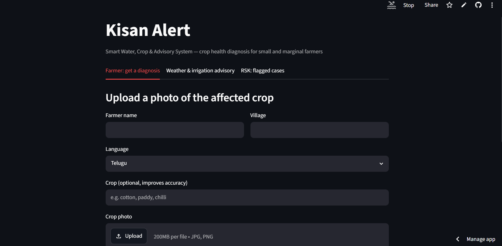

# Kisan Alert — Smart Water, Crop & Advisory System

Built for the farmers who want advices about their crops

# Drive video link how to use
https://drive.google.com/file/d/1zVZVTwNKH1lubeK3x6YRct4Cxx1cYlE_/view?usp=drivesdk

# Live demo
https://kisan-alert-v7ogbp8umwp25t72rgfzj9.streamlit.app/


## Screenshots

### Farmer diagnosis screen



**Two working core flows:**
1. **Crop health diagnosis** — voice or typed description + photo, analyzed by
   Gemini, spoken back in the farmer's language, with automatic escalation to
   a Rythu Seva Kendra (RSK) for uncertain/severe cases.
2. **Weather & dry-spell irrigation advisory** — 7-day rainfall forecast for
   the farmer's village, with a simple rule-based dry-spell alert.

**Runs entirely on free tiers — no credit card, no GCP billing account, no subscriptions.**

## Stack
- Gemini API (Google AI Studio) — multimodal diagnosis, audio understanding, translation, TTS
- Open-Meteo — weather forecast + geocoding, completely free, no API key required
- Firestore (Firebase Spark plan) — case logging
- Streamlit — UI, including native browser microphone recording (`st.audio_input`)
- Deployed free on Streamlit Community Cloud

## Setup

1. Get a free Gemini API key: https://aistudio.google.com/apikey
2. Create a Firebase project + Firestore database (Native mode): https://console.firebase.google.com
3. Download a Firebase service account key: Project settings > Service accounts > Generate new private key

```bash
python -m venv venv
source venv/bin/activate
pip install -r requirements.txt

export GEMINI_API_KEY=your-key-here
export GOOGLE_APPLICATION_CREDENTIALS=path/to/firebase-key.json

streamlit run app.py
```

## Deploy (free)
Push to a public GitHub repo, then deploy at https://share.streamlit.io —
point it at `app.py`, and add `GEMINI_API_KEY` + your Firebase key JSON
contents under Advanced settings > Secrets.

## Roadmap (not built for this submission)
- Crop recommendation engine (satellite + soil data)
- Full SMS/IVR gateway for farmers without smartphones
Both would plug into the same `cases` Firestore collection.

## Tools & Technologies Used

### APIs
- Gemini API (gemini-2.5-flash) — Google AI Studio — multimodal crop diagnosis
- Gemini API (gemini-2.5-flash-preview-tts) — Google AI Studio — spoken advisory generation
- Open-Meteo Geocoding + Forecast API — village lookup and 7-day rainfall forecast, no key needed
- Firestore — Firebase (Spark free plan) — case logging + RSK dashboard

### Software / Frameworks
- Python 3.x
- Streamlit (including native `st.audio_input` for live mic recording)
- google-generativeai (Python SDK)
- google-cloud-firestore (Python SDK)
- requests (for Open-Meteo API calls)
- Pillow (image handling)
- Git & GitHub — version control and source hosting
- Streamlit Community Cloud — free deployment

### Hardware
- Standard laptop/desktop for development
- Farmer's smartphone (real deployment) — camera + microphone
- No specialized/IoT hardware required

### Cost
Entirely free — no credit card or paid subscription anywhere, for development or pilot-scale deployment.
